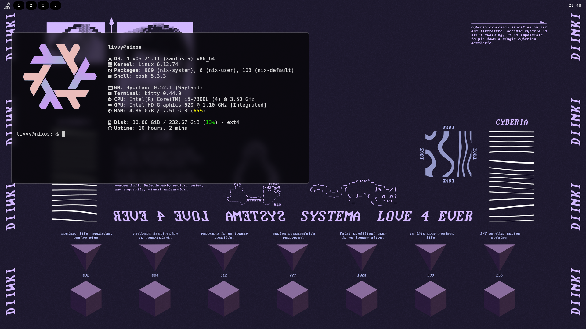

# DotsLand Hyprland Configuration

Minimalist dotfiles for **Hyprland** and commonly used Linux applications.  
This repository contains lightweight, clean configurations designed for simplicity and efficiency.
<br>

<br>
## Included Configurations

- **Hyprland** – Wayland window manager  
- **Kitty** – terminal emulator  
- **Waybar** – status bar for Wayland  
- **Rofi** – application launcher and menu  
- **Fastfetch** – system info tool  
- **Nautilus** – file manager  
- **Swaylock / Swaylock-effects** – screen lock 

---

## Features

- Lightweight and minimal configurations for a clean desktop experience.  
- Ready-to-use setups for Hyprland and supporting tools.  
- Easy backup of existing configurations before installing.  

---

## Installation

1. Clone the repository:

```bash 
git clone https://github.com/JustLivvu/DotsLand.git
cd DotsLand

```
2. Launch installation script:
```bash
bash install.sh
```

---

## Default Keybinds

| Key Combination       | Action / Command                                |
|----------------------|-------------------------------------------------|
| `$mainMod + T`        | Open terminal (`$terminal`)                    |
| `$mainMod + Q`        | Kill active window                              |
| `$mainMod + M`        | Exit Hyprland                                   |
| `$mainMod + F`        | Open file manager (`$fileManager`)             |
| `$mainMod + V`        | Toggle floating mode                            |
| `$mainMod + R`        | Open menu (`$menu`)                             |
| `$mainMod + P`        | Pseudo (custom action)                          |
| `$mainMod + J`        | Toggle split layout                             |
| `$mainMod + L`        | Lock screen (`$lock`)                           |
| `$mainMod + B`        | Open browser (`$browser`)                       |
| `$mainMod + X`        | Run screenshot script (`~/.config/hypr/scripts/screenshot.sh`) |

[](https://starchart.cc/JustLivvu/DotsLand)

